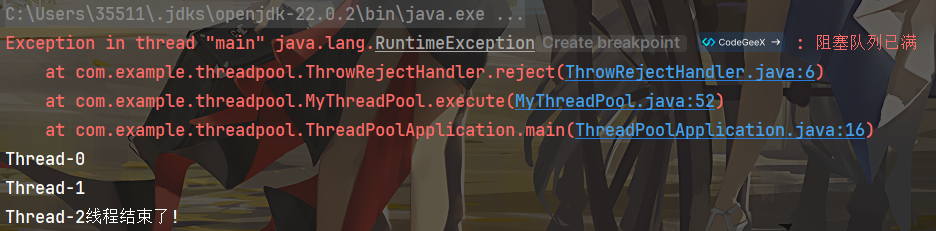

# mini-thread-pool

手写一个简单的mini线程池

**blog链接**：[🥽 实现简单线程池 | Blog](https://scmrcore.github.io/Notes/CodeMemoirs/手写线程池.html)

**测试使用**：

```java
MyThreadPool myThreadPool = new MyThreadPool(corePoolSize, maxPoolSize, timeout, timeUnit, BlockingQueue, RejectHandler;

myThreadPool.execute(()->{
    your task
});
```

**遗憾**：未能实现execute原子性，未能实现shutdown，未能实现ThreadFactory

- 涉及知识点：exception，LockSupport，阻塞队列，线程池
- 文件结构：

```powershell
thread-pool/
├── src/
│   ├── main/
│     ├── java/
│     │   └── com.example.threadpool/
│     │       ├── MyThreadPool.java
│     │       ├── RejectHandle.java
│     │       ├── ThreadPoolApplication.java
│     │       └── ThrowRejectHandler.java
│     └── resources/
│         └── application.yml
├── pom.xml
```

- 执行结果：基本符合

